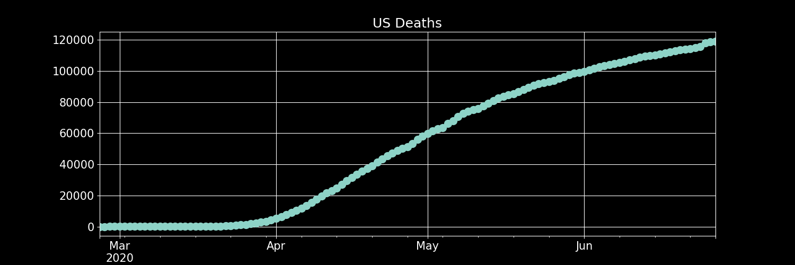
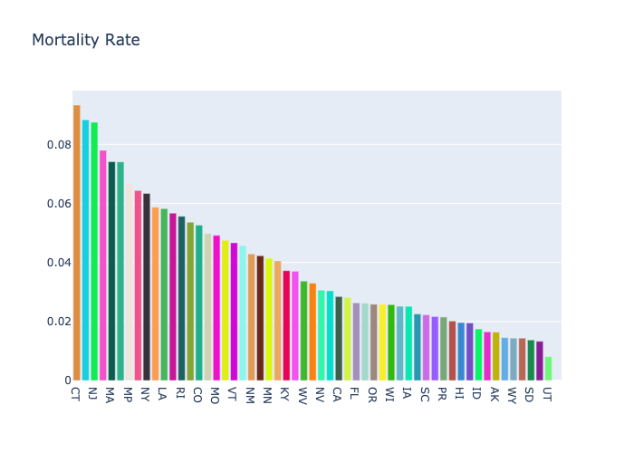

# Tracking Covid Testing Data
Data is being tracked using [The Covid Tracking Project](https://covidtracking.com/)

**Visualizations are updated daily.**

The API documentation can be found [here](https://covidtracking.com/api/)

>Code for this project can be found in [covid19_update.py](./covid19_update.py)

### [Click here for Individual States](./states/)

# US –– Visualizations

