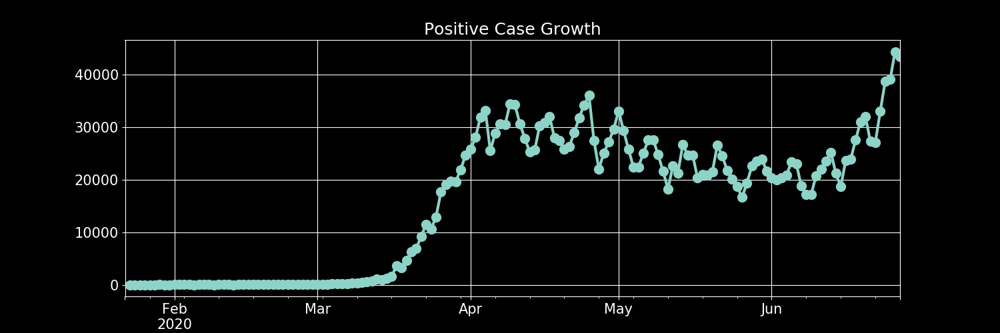
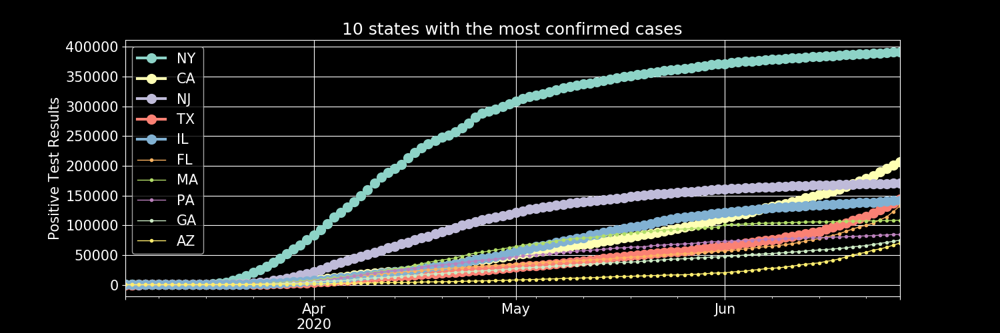
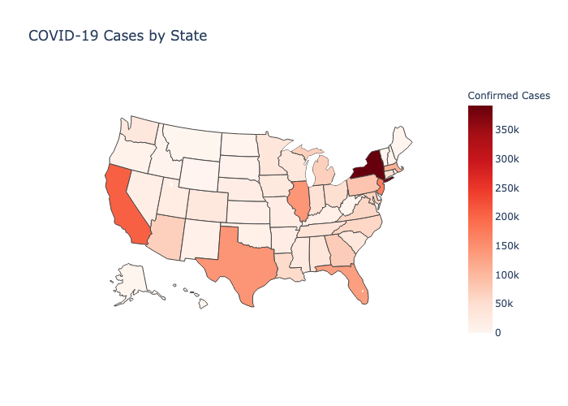

# Tracking Covid Testing Data
Data is being tracked using [The Covid Tracking Project](https://covidtracking.com/)

**Visualizations are updated daily.**

The API documentation can be found [here](https://covidtracking.com/api/)

>An old version of this project collected data via webscraping. The code for that version of the project can be found at the bottom of the Coronavirus_data_tracker notebook.

### [Click here for Individual States](https://github.com/joelsewhere/covid-19/tree/master/states)

# US –– Visualizations

