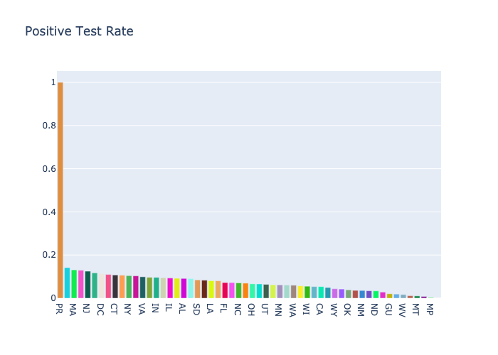

# Tracking Covid Testing Data
Data is being being tracked using [The Covid Tracking Project](https://covidtracking.com/)

Currently, the data is being collected via webscraping. An [API](https://covidtracking.com/api/) has been added to the project and will be integrated into this repo soon.

# Visualizations:

